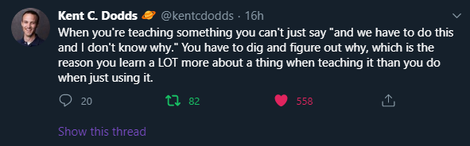

## Game On

Como já deve ter percebido, meu nome é Emerson Paiva, hoje (23/06) estou completando 25 anos (parabéns pra mim🎉) e após um bom tempo deixando esse projeto de lado, escolhi como presente de aniversário dar o ponta pé inicial nesse blog (agora vai).

## Por que criar esse blog?

Eu acredito quando dizem que você aprende muito tentando ajudar outros, e desde que eu comecei a minha jornada como desenvolvedor, lá no estágio, eu já queria compartilhar um pouco da minha carreira e do que eu venho aprendendo, e cheguei a fazer um post no [Medium](https://medium.com/@emersonpaiva/e-acabou-o-melhor-ano-da-minha-vida-at%C3%A9-agora-bb37811d6c89) após adquirir meu primeiro emprego como desenvolvedor, e deixei alguns rascunhos mofando por lá. Agora estou decidido a isso fazer acontecer!

*[Kent C. Dodds](https://twitter.com/kentcdodds/status/1275166873689001984)*

Eu poderia continuar utilizando o Medium ou melhor ainda, o [dev.to](https://dev.to/), mas o que eu estou buscando vai um pouco além de compartilhar conteúdo e eu quero uma plataforma 100% customizável, onde eu sou o todo poderoso.

Tive um pouco de trabalho, principalmente na criação do layout, mesmo que incompleto, mas se você chegou até aqui, então já valeu a pena 💜.

## Meus Planos

Já tenho algumas anotações no meu [Notion](https://www.notion.so/) e ideias para compartilhar aqui, em alguns dias teremos algumas postagens relacionadas ao desenvolvimento **Front End** e bastante React.js.

*[South Park](https://pt.wikipedia.org/wiki/South_Park)*

Meu objetivo primário é compartilhar conteúdo de tecnológia, porém, nos meus planos estão conteúdos mais pessoas (prometo deixar isso em uma seção separada, para não desviar nosso foco aqui), como recomendações de músicas, filmes etc., então não se espante se acabar encontrando uma citação a filmes como [(500) Days of Summer](https://pt.wikipedia.org/wiki/(500)_Days_of_Summer) por exemplo.

Então, escolha um assento e vamos embarcar nessa jornada comigo. 🙂

Ah! Todo conteúdo aqui é [open source](https://pt.wikipedia.org/wiki/C%C3%B3digo_aberto), então, se encontrar alguma coisa errada, eu vou adorar receber o seu pull request lá no [github](https://github.com/oemersonpaiva/emersonpaiva.dev) 💜.

Obrigado!!!